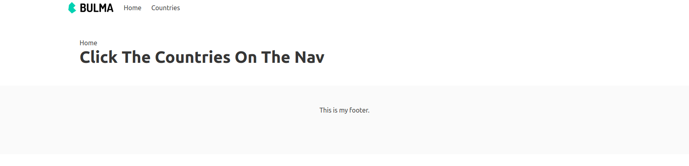
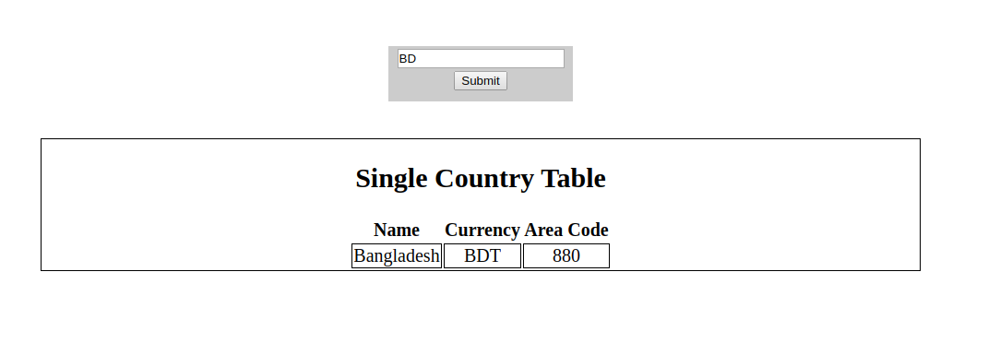

# Aaroza-Frontend-Solution

## Task-1

### Installation
1. After downloading this repo , you have to change current directory to  `Task-1` directory in your terminal.
2. Then you have to copy paste below command in your terminal.
    ```
    npm install
    ```
3. To start the project you have to copy paste below command in your terminal.

    ```
    live-server
    ```

#### Task 1.1 You have to click `Countries` to get all of the countries.



#### Task 1.2 If you clicked `Countries` you will get every Country with clickable link with them.


#### Task 1.3 If you clicked any countries, you will have below result



## Task-2

#### Task 2 Landing page

