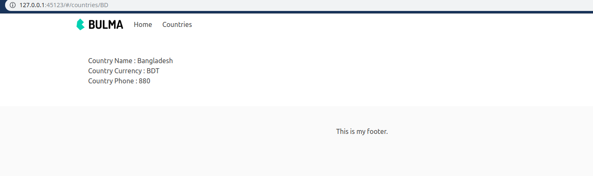

# Aaroza-Frontend-Solution

## Task-1

### Task 1.1 You have to click either of them.

### Task 1.2 If you clicked `All Countries` you will get below picture result

### Task 1.3 If you clicked `Single Country` you have to give a value in the input form and you will get below picture result

## Task-2

### Task 2 Landing page

